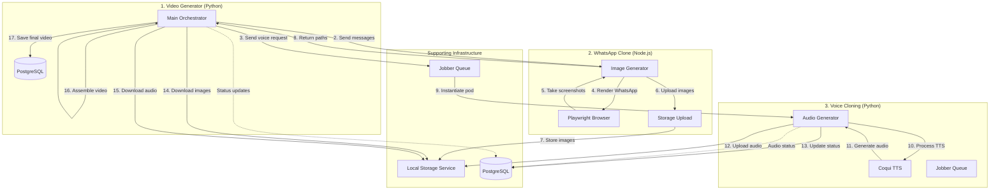
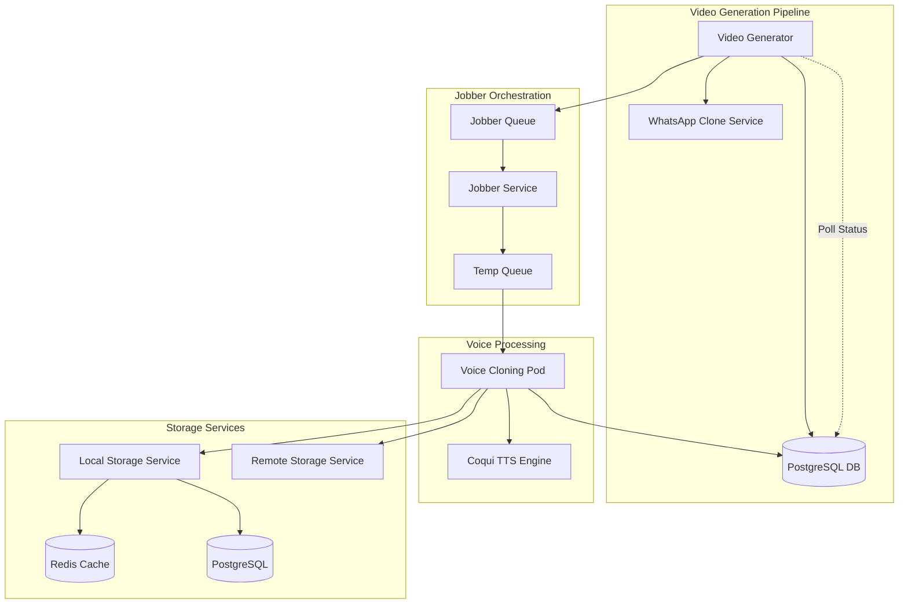
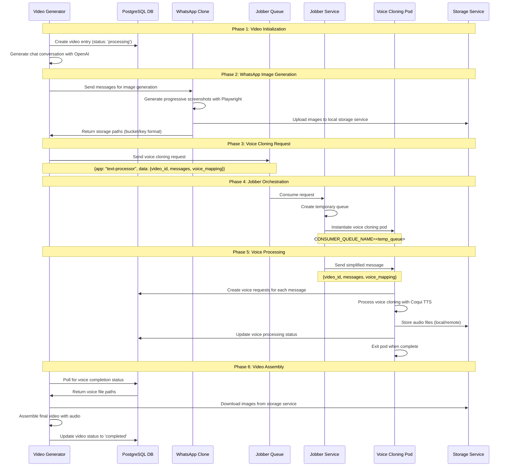
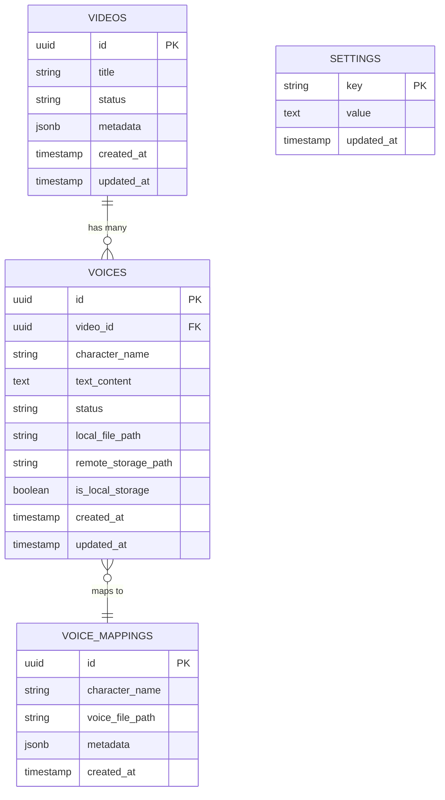
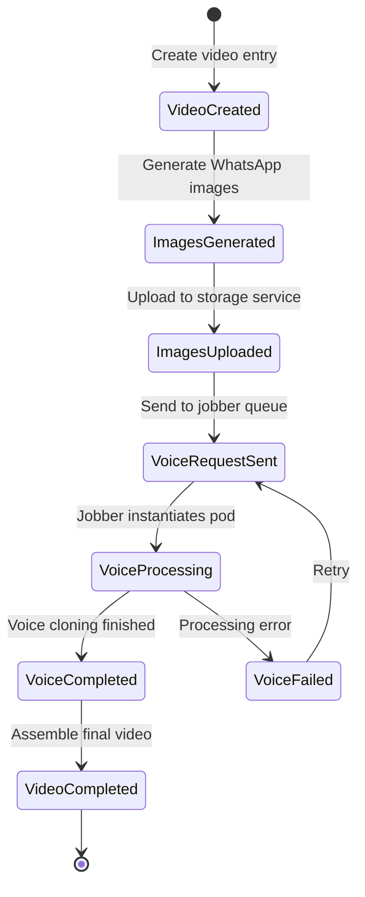
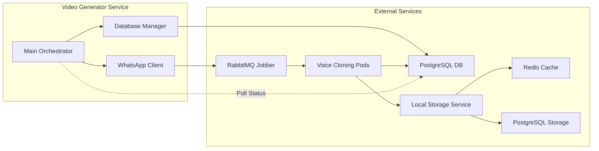

# WhatsApp Video Generator

A microservice system that generates WhatsApp-style videos with custom conversations, using Python and Node.js components with integrated local storage service.

## 🏗️ Architecture

The system consists of three core components:

1. **Video Generator (Python)** - Main Orchestrator:
   - Generates chat conversations using OpenAI API
   - Coordinates between WhatsApp Clone and Voice Cloning services
   - Downloads images from storage service
   - Assembles final video with background overlay and audio

2. **WhatsApp Clone (Node.js)** - Image Generation Service:
   - Receives message JSON from Video Generator
   - Uses Playwright to render React WhatsApp clone
   - Takes progressive screenshots (1 message, 2 messages, etc.)
   - Uploads images to local storage service
   - Returns storage paths to Video Generator

3. **Voice Cloning (Python)** - Audio Generation Service:
   - Receives voice cloning requests via Jobber queue
   - Processes text-to-speech for each message
   - Uses Coqui TTS with voice cloning capabilities
   - Uploads audio files to storage service
   - Updates database with audio processing status

**Supporting Infrastructure:**
- **Local Storage Service** (Rust): High-performance S3-like storage with Redis caching
- **Jobber Queue**: Orchestrates voice cloning pod instantiation
- **PostgreSQL**: Stores video metadata and processing status

## 🔄 Complete System Workflow

This system integrates with a jobber-based microservices architecture for scalable video generation with voice cloning and local storage.

### **Core 3 Components Flow**



### **Step-by-Step Flow Between Core Components**

1. **Video Generator (Python)** starts the process:
   - Generates chat conversation using OpenAI API
   - Creates video entry in PostgreSQL database

2. **Video Generator → WhatsApp Clone (Node.js)**:
   - Sends message JSON to WhatsApp Clone service
   - WhatsApp Clone renders React app with Playwright
   - Takes progressive screenshots (1, 2, 3... messages)
   - Uploads images to Local Storage Service
   - Returns storage paths to Video Generator

3. **Video Generator → Voice Cloning (Python)** (parallel):
   - Sends voice cloning request to Jobber Queue
   - Jobber instantiates Voice Cloning pod
   - Voice Cloning processes each message with Coqui TTS
   - Uploads audio files to Local Storage Service
   - Updates processing status in PostgreSQL

4. **Video Generator assembles final video**:
   - Downloads images from Local Storage Service
   - Downloads audio files from Local Storage Service
   - Assembles final video with background overlay
   - Saves completed video to output directory

### **High-Level System Architecture**



### **Detailed Workflow Sequence**



### **Database Schema**



### **Message Flow States**



### **Service Communication**



## 🚀 Quick Start

### Prerequisites
- Docker and Docker Compose
- OpenAI API key
- Local Storage Service running at `http://192.168.1.218:30880`

### Setup
1. Set your OpenAI API key:
   ```bash
   export OPENAI_API_KEY="your-api-key-here"
   ```

2. Build and run the system:
   ```bash
   docker-compose up --build
   ```

3. The system will:
   - Build the React WhatsApp clone with Playwright
   - Start the Node.js server on port 3001
   - Generate a WhatsApp video with the default prompt
   - Upload images to local storage service
   - Save the output to `./output/output_with_overlay.mp4`

## 🔧 How It Works

### 1. Message Flow
```
Python Service → OpenAI API → Chat JSON → Node.js Service → WhatsApp Images → Storage Service
```

### 2. Node.js Integration
The Node.js service:
- Runs an Express server on port 3001
- Serves the React WhatsApp clone
- Uses Playwright for headless browser automation
- Uploads images to local storage service
- Provides API endpoints:
  - `POST /api/generate-screenshots` - Generate progressive screenshots
  - `GET /api/messages` - Get current messages
  - `GET /api/health` - Health check with storage status

### 3. Image Generation Process
1. Python sends message JSON to Node.js service
2. Node.js updates the React app with messages
3. Playwright takes screenshots progressively:
   - Screenshot 1: 1 message
   - Screenshot 2: 2 messages
   - Screenshot 3: 3 messages
   - etc.
4. Node.js uploads images to local storage service
5. Node.js returns storage paths (bucket/key format) to Python
6. Python downloads images from storage service for video assembly

### 4. Storage Integration
- **Local Storage Service**: Rust-based high-performance storage
- **Redis Caching**: Sub-millisecond file metadata access
- **PostgreSQL**: Robust metadata storage with advanced indexing
- **Compression**: ZSTD/GZIP with configurable thresholds
- **Encryption**: AES-GCM & ChaCha20-Poly1305 support (optional)

## 📁 Project Structure

```
makeMoney/
├── video_generator/          # Python orchestrator
│   ├── main.py              # Main entry point
│   ├── whatsapp_gen/        # Chat generation
│   ├── tts/                 # Text-to-speech
│   ├── video_overlay/       # Video assembly
│   └── utils/               # Utilities
├── whatsapp-clone/          # Node.js image generator
│   ├── server.js            # Express server with Playwright
│   ├── src/                 # React app
│   ├── package.json         # Node.js dependencies
│   └── Dockerfile           # Container with Playwright
├── voice_cloning/           # Voice cloning service
│   ├── src/                 # Voice processing
│   ├── storage_client.py    # Local storage integration
│   └── Dockerfile           # Voice cloning container
├── background_videos/        # Background video files
├── output/                  # Generated videos
├── Dockerfile               # Container setup
└── docker-compose.yml       # Service orchestration
```

## 🎯 Customization

### Custom Prompts
```bash
docker-compose run --rm whatsapp-video-generator --prompt "Uma conversa engraçada sobre programação"
```

### Custom Participants
```bash
docker-compose run --rm whatsapp-video-generator --participants "João" "Maria"
```

### Storage Configuration
```bash
# Environment variables for storage integration
LOCAL_STORAGE_URL=http://192.168.1.218:30880
WHATSAPP_STORAGE_BUCKET=whatsapp-screenshots
UPLOAD_MODE=on
UPLOAD_SERVICE=local
```

### Testing Node.js Service
```bash
python test_node_service.py
```

## 🔍 Troubleshooting

### Node.js Service Issues
- Check if port 3001 is available
- Verify React app builds successfully
- Check Docker logs: `docker-compose logs whatsapp-video-generator`
- Ensure Playwright browsers are installed in container

### Image Generation Issues
- Ensure Playwright dependencies are installed
- Check if React app loads correctly
- Verify message JSON format
- Check storage service connectivity

### Storage Service Issues
- Verify storage service is running at `http://192.168.1.218:30880`
- Check network connectivity from container to storage service
- Verify bucket exists: `curl http://192.168.1.218:30880/buckets`
- Check storage service logs for upload errors

### Video Generation Issues
- Check OpenAI API key is set
- Verify background videos exist
- Check output directory permissions
- Ensure storage service is accessible

## 🛠️ Development

### Local Development
1. Start Node.js service:
   ```bash
   cd whatsapp-clone
   npm install
   cd src && npm install && npm run build && cd ..
   node server.js
   ```

2. Run Python service:
   ```bash
   cd video_generator
   pip install -r requirements.txt
   python main.py
   ```

### API Endpoints

#### Generate Screenshots
```bash
curl -X POST http://localhost:3001/api/generate-screenshots \
  -H "Content-Type: application/json" \
  -d '{
    "messages": [...],
    "participants": ["Ana", "Bruno"],
    "outputDir": "./output",
    "img_size": [1920, 1080]
  }'
```

Response format:
```json
{
  "success": true,
  "imageUrls": ["http://192.168.1.218:30880/download/whatsapp_123.png?bucket=whatsapp-screenshots"],
  "storagePaths": ["whatsapp-screenshots/whatsapp_123.png"],
  "messageCoordinates": [...],
  "message": "Generated and uploaded 1 screenshot successfully"
}
```

#### Health Check
```bash
curl http://localhost:3001/api/health
```

Response includes storage service status:
```json
{
  "status": "ok",
  "config": {
    "uploadMode": true,
    "uploadService": "local",
    "localStorageUrl": "http://192.168.1.218:30880",
    "whatsappStorageBucket": "whatsapp-screenshots"
  },
  "services": {
    "storage": "healthy"
  }
}
```

## 📝 Notes

- The system uses a phone aspect ratio (portrait) for videos
- Images are generated progressively to sync with TTS audio
- Background videos are randomly selected from the `background_videos/` folder
- The React WhatsApp clone provides a realistic WhatsApp interface
- All services run in a single Docker container for simplicity
- Images are uploaded to local storage service for persistence
- Playwright provides better Docker compatibility than Puppeteer
- Storage service provides 5-10x performance improvement over file system 