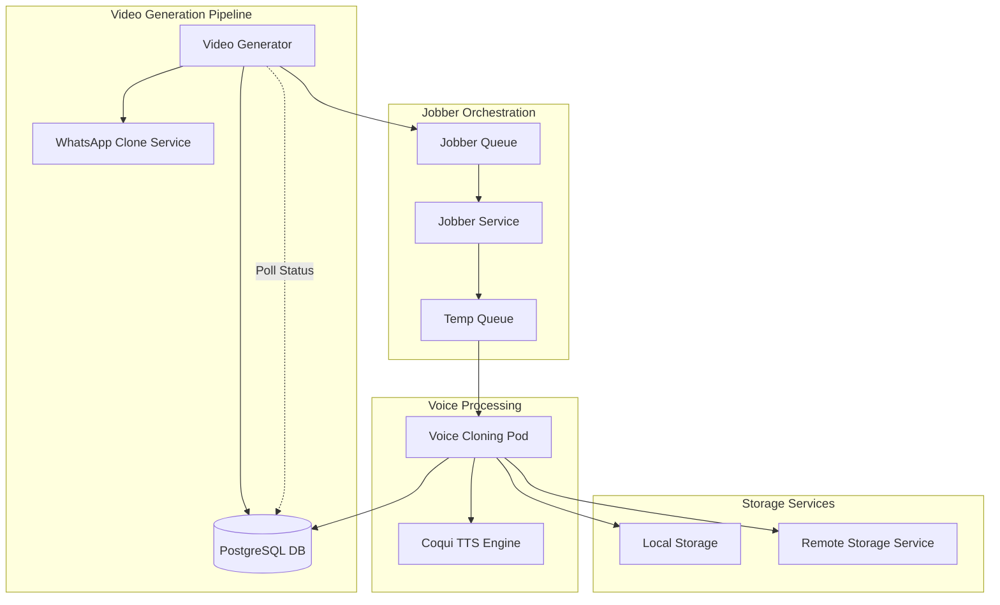
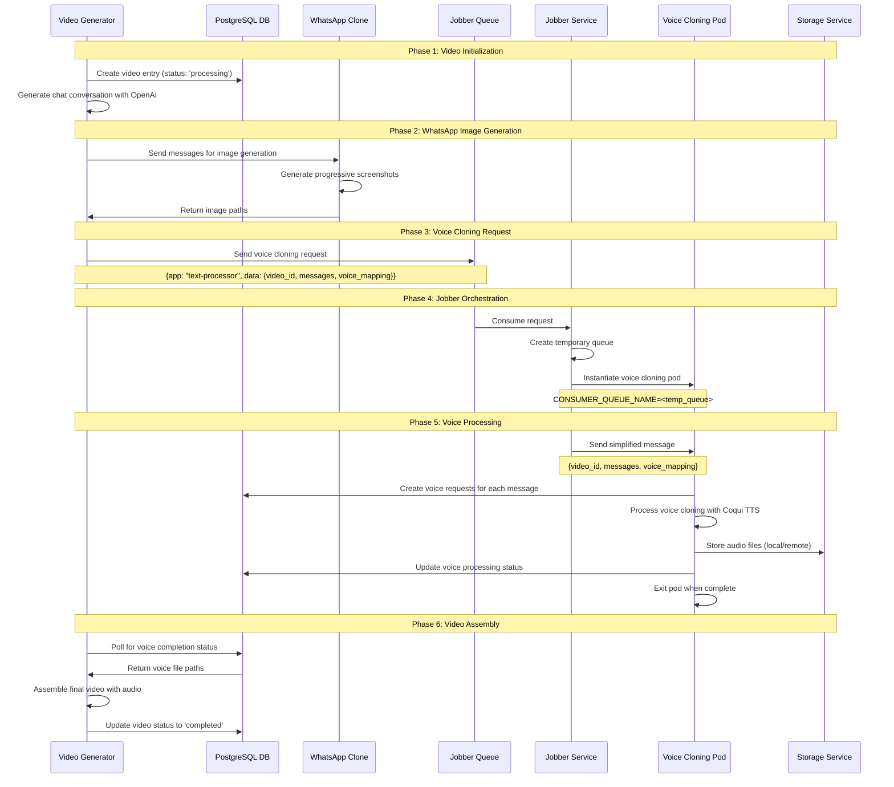
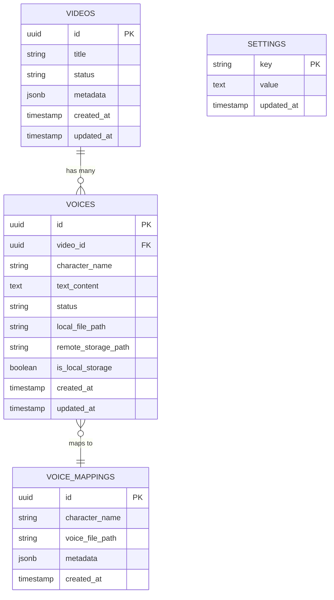
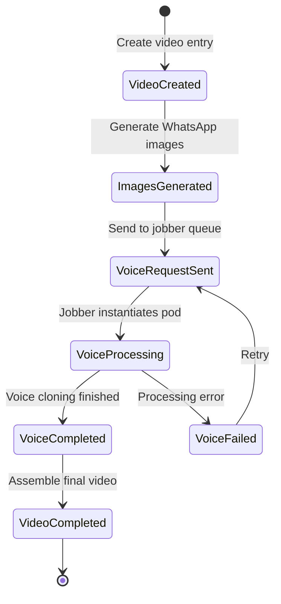
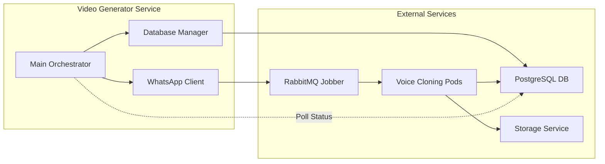

# WhatsApp Video Generator

A microservice system that generates WhatsApp-style videos with custom conversations, using Python and Node.js components running in the same Docker container.

## 🏗️ Architecture

The system consists of two main components:

1. **Python Service** (Orchestrator):
   - Generates chat conversations using OpenAI API
   - Creates TTS audio for each message
   - Calls Node.js service to generate WhatsApp images
   - Assembles final video with background overlay

2. **Node.js Service** (Image Generator):
   - Receives message JSON from Python service
   - Uses Puppeteer to render React WhatsApp clone
   - Takes progressive screenshots (1 message, 2 messages, etc.)
   - Returns image paths to Python service

## 🔄 Complete System Workflow

This system integrates with a jobber-based microservices architecture for scalable video generation with voice cloning.

### **High-Level System Architecture**



### **Detailed Workflow Sequence**



### **Database Schema**



### **Message Flow States**



### **Service Communication**



## 🚀 Quick Start

### Prerequisites
- Docker and Docker Compose
- OpenAI API key

### Setup
1. Set your OpenAI API key:
   ```bash
   export OPENAI_API_KEY="your-api-key-here"
   ```

2. Build and run the system:
   ```bash
   docker-compose up --build
   ```

3. The system will:
   - Build the React WhatsApp clone
   - Start the Node.js server on port 3001
   - Generate a WhatsApp video with the default prompt
   - Save the output to `./output/output_with_overlay.mp4`

## 🔧 How It Works

### 1. Message Flow
```
Python Service → OpenAI API → Chat JSON → Node.js Service → WhatsApp Images
```

### 2. Node.js Integration
The Node.js service:
- Runs an Express server on port 3001
- Serves the React WhatsApp clone
- Uses Puppeteer to take screenshots
- Provides API endpoints:
  - `POST /api/generate-screenshots` - Generate progressive screenshots
  - `GET /api/messages` - Get current messages
  - `GET /api/health` - Health check

### 3. Image Generation Process
1. Python sends message JSON to Node.js service
2. Node.js updates the React app with messages
3. Puppeteer takes screenshots progressively:
   - Screenshot 1: 1 message
   - Screenshot 2: 2 messages
   - Screenshot 3: 3 messages
   - etc.
4. Node.js returns image paths to Python
5. Python uses images to create final video

## 📁 Project Structure

```
makeMoney/
├── video_generator/          # Python orchestrator
│   ├── main.py              # Main entry point
│   ├── whatsapp_gen/        # Chat generation
│   ├── tts/                 # Text-to-speech
│   ├── video_overlay/       # Video assembly
│   └── utils/               # Utilities
├── whatsapp-clone/          # Node.js image generator
│   ├── server.js            # Express server
│   ├── src/                 # React app
│   └── package.json         # Node.js dependencies
├── background_videos/        # Background video files
├── output/                  # Generated videos
├── Dockerfile               # Container setup
└── docker-compose.yml       # Service orchestration
```

## 🎯 Customization

### Custom Prompts
```bash
docker-compose run --rm whatsapp-video-generator --prompt "Uma conversa engraçada sobre programação"
```

### Custom Participants
```bash
docker-compose run --rm whatsapp-video-generator --participants "João" "Maria"
```

### Testing Node.js Service
```bash
python test_node_service.py
```

## 🔍 Troubleshooting

### Node.js Service Issues
- Check if port 3001 is available
- Verify React app builds successfully
- Check Docker logs: `docker-compose logs whatsapp-video-generator`

### Image Generation Issues
- Ensure Puppeteer dependencies are installed
- Check if React app loads correctly
- Verify message JSON format

### Video Generation Issues
- Check OpenAI API key is set
- Verify background videos exist
- Check output directory permissions

## 🛠️ Development

### Local Development
1. Start Node.js service:
   ```bash
   cd whatsapp-clone
   npm install
   cd src && npm install && npm run build && cd ..
   node server.js
   ```

2. Run Python service:
   ```bash
   cd video_generator
   pip install -r requirements.txt
   python main.py
   ```

### API Endpoints

#### Generate Screenshots
```bash
curl -X POST http://localhost:3001/api/generate-screenshots \
  -H "Content-Type: application/json" \
  -d '{
    "messages": [...],
    "participants": ["Ana", "Bruno"],
    "outputDir": "./output",
    "img_size": [1920, 1080]
  }'
```

#### Health Check
```bash
curl http://localhost:3001/api/health
```

## 📝 Notes

- The system uses a phone aspect ratio (portrait) for videos
- Images are generated progressively to sync with TTS audio
- Background videos are randomly selected from the `background_videos/` folder
- The React WhatsApp clone provides a realistic WhatsApp interface
- All services run in a single Docker container for simplicity 