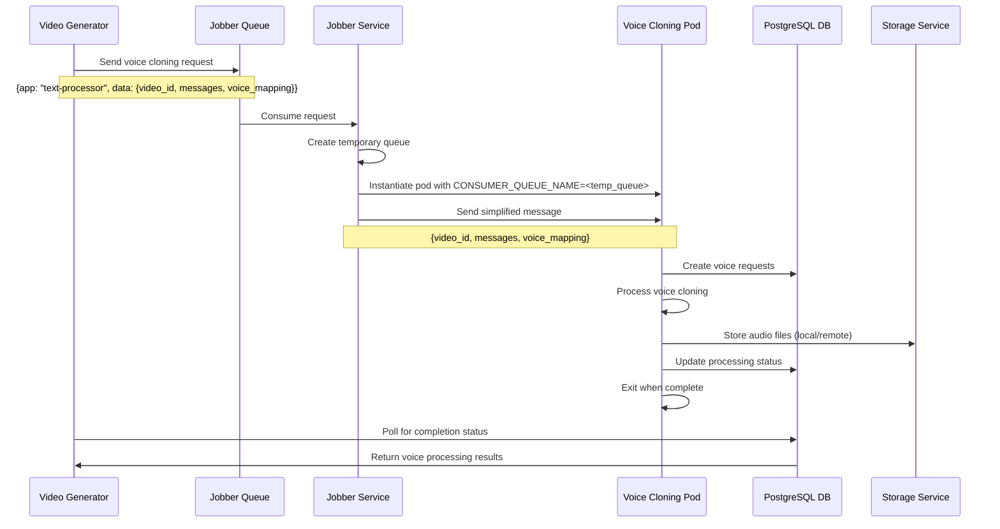
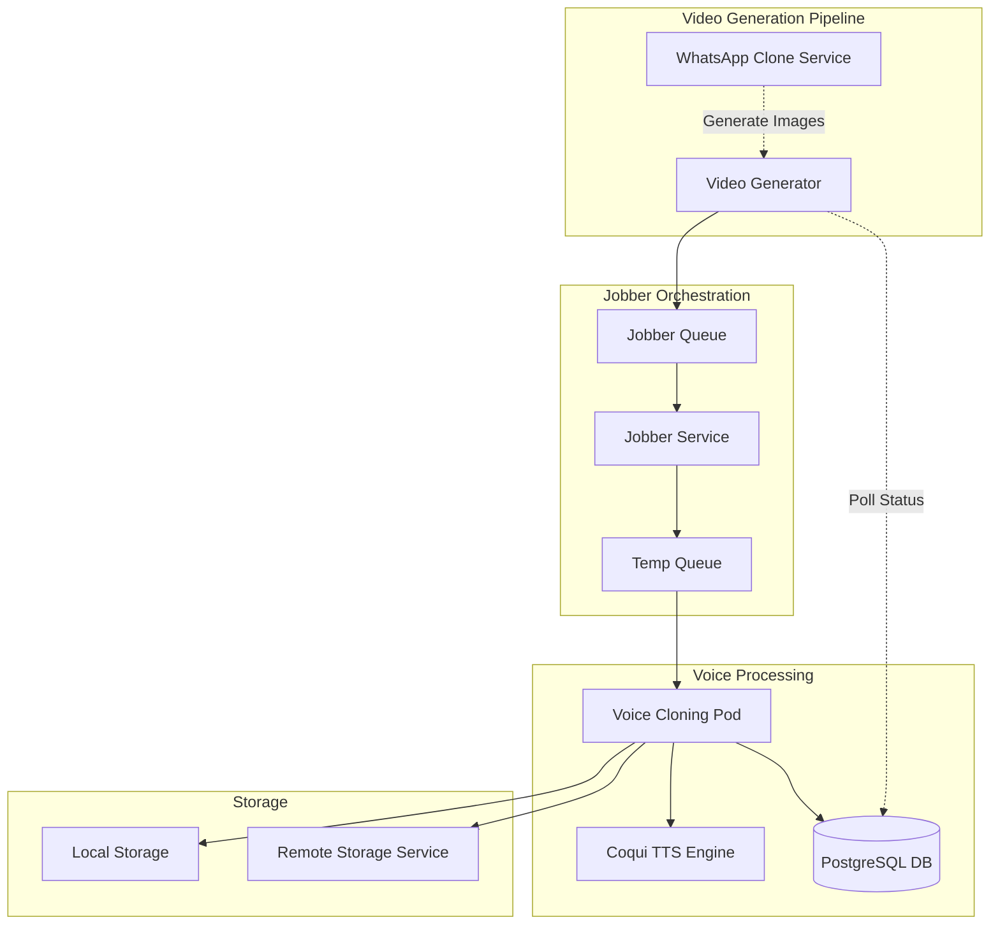
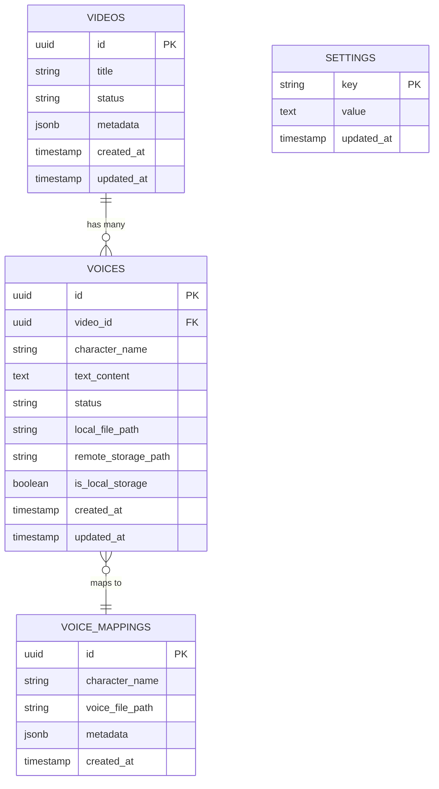

# Voice Cloning Kubernetes Microservice

A Kubernetes-ready microservice for voice cloning using Coqui TTS with XTTS v2 model. Consumes messages from a queue and generates high-quality voice-cloned audio.

## 🚀 Features

- **Queue-based Processing**: Consumes TTS requests from a message queue (RabbitMQ or Mock)
- **Voice Cloning**: Advanced voice cloning with Coqui TTS and XTTS v2 model
- **Kubernetes Ready**: Complete Docker and K8s deployment setup
- **Progress Logging**: Detailed progress tracking and performance metrics
- **Graceful Shutdown**: Proper signal handling for container orchestration
- **Auto Voice Detection**: Automatically detect available voice files
- **Batch Processing**: Generate TTS for multiple messages at once
- **Automatic License Handling**: No manual intervention required for model licensing
- **Dynamic Voice Mapping**: Voice files can be specified per request via RabbitMQ messages
- **Jobber Integration**: Works with jobber service for dynamic pod instantiation
- **Database Integration**: PostgreSQL integration for tracking voice processing status
- **Storage Flexibility**: Support for both local and remote voice file storage

## 🔄 Workflow Integration

This service integrates with a jobber-based workflow for dynamic voice processing. Here's how it works:

### **Jobber Workflow Diagram**



### **System Architecture**



### **Message Flow**

```mermaid
flowchart LR
    subgraph "1. Video Generator"
        A[Create video entry in DB]
        B[Generate WhatsApp images]
        C[Send to jobber queue]
    end
    
    subgraph "2. Jobber Service"
        D[Receive request]
        E[Create temp queue]
        F[Instantiate voice pod]
    end
    
    subgraph "3. Voice Cloning"
        G[Listen to temp queue]
        H[Create voice requests in DB]
        I[Process voice cloning]
        J[Update DB status]
        K[Exit pod]
    end
    
    subgraph "4. Video Generator"
        L[Poll DB for completion]
        M[Continue video generation]
    end
    
    A --> B --> C --> D --> E --> F --> G --> H --> I --> J --> K --> L --> M
```



### **Database Schema Integration**



## 📋 Prerequisites

- Python 3.12+
- Docker
- Kubernetes cluster
- Message queue system (RabbitMQ)
- Coqui TTS with XTTS v2 model

## 🏗️ Architecture

```
┌─────────────────┐    ┌──────────────────┐    ┌─────────────────┐
│   Message Queue │───▶│  Voice Cloning   │───▶│  Audio Output   │
│   (RabbitMQ)    │    │   Microservice   │    │                 │
└─────────────────┘    └──────────────────┘    └─────────────────┘
                              │
                              ▼
                       ┌──────────────────┐
                       │   Coqui TTS      │
                       │  - XTTS v2       │
                       │  - Voice Cloning │
                       └──────────────────┘
```

## 🐳 Docker Build

```bash
# Build the Docker image
docker build -t voice-cloning-service:latest .

# Test locally with mock mode
docker run -e USE_MOCK_MODE=true voice-cloning-service:latest

# Test with RabbitMQ
docker run -e RABBITMQ_HOST=your-rabbitmq-host voice-cloning-service:latest
```

## ☸️ Kubernetes Deployment

```bash
# Apply the deployment
kubectl apply -f k8s-deployment.yaml

# Check deployment status
kubectl get pods -l app=voice-cloning-service

# View logs
kubectl logs -l app=voice-cloning-service -f
```

## 🔧 Configuration

### Environment Variables

| Variable | Default | Description |
|----------|---------|-------------|
| `CONSUMER_QUEUE_NAME` | `voice-cloning-queue` | Queue name to consume from |
| `PYTHONUNBUFFERED` | `1` | Python output buffering |
| `USE_MOCK_MODE` | `false` | Use mock mode for development testing |
| `RABBITMQ_HOST` | `localhost` | RabbitMQ server host |
| `RABBITMQ_PORT` | `5672` | RabbitMQ server port |
| `RABBITMQ_USER` | `guest` | RabbitMQ username |
| `RABBITMQ_PASSWORD` | `guest` | RabbitMQ password |
| `RABBITMQ_VHOST` | `/` | RabbitMQ virtual host |
| `OUTPUT_DIR` | `/tmp/voice_cloning_output` | Output directory for generated audio |
| `COQUI_TOS_AGREED` | `1` | Auto-accept Coqui TTS license |

### TTS Configuration

```python
TTS_CONFIG = {
    'model_name': "tts_models/multilingual/multi-dataset/xtts_v2",
    'language': "pt-br",  # Brazilian Portuguese
    'timeout': 60,  # seconds
    'auto_accept_license': True,  # Auto-accept license prompts
}
```

### Parallel Processing Configuration

```python
PARALLEL_CONFIG = {
    'enabled': False,  # Disabled for microservice (processes one message at a time)
    'max_workers': 2,  # Number of parallel workers (if enabled)
    'chunk_size': 1,   # Batch size for processing
}
```

## 📨 Message Format

### Single TTS Request

```json
{
  "id": "request-123",
  "type": "single",
  "text": "Hello, this is a test message",
  "voice_file": "/path/to/voice.wav",
  "output_filename": "output.wav",
  "output_dir": "/tmp/output"
}
```

### Batch TTS Request

```json
{
  "id": "batch-456",
  "type": "batch",
  "messages": [
    {
      "text": "Hello from user 1",
      "from_user": "user1"
    },
    {
      "text": "Hello from user 2", 
      "from_user": "user2"
    }
  ],
  "voice_mapping": {
    "user1": "/path/to/voice1.wav",
    "user2": "/path/to/voice2.wav"
  },
  "output_dir": "/tmp/batch_output",
  "use_voice_cloning": true
}
```

## 📊 Response Format

### Success Response

```json
{
  "success": true,
  "audio_path": "/tmp/output.wav",
  "file_size": 12345,
  "timestamp": "2025-07-17T20:44:41.123456"
}
```

### Batch Success Response

```json
{
  "success": true,
  "audio_paths": [
    "/tmp/batch_output/user1/msg_0_user1.wav",
    "/tmp/batch_output/user2/msg_1_user2.wav"
  ],
  "stats": {
    "total_messages": 2,
    "successful_generations": 2,
    "failed_generations": 0,
    "success_rate": 100.0
  },
  "timestamp": "2025-07-17T20:44:41.123456"
}
```

### Error Response

```json
{
  "success": false,
  "error": "Failed to generate audio",
  "timestamp": "2025-07-17T20:44:41.123456"
}
```

## 🎤 Voice Files

Place your reference voice files in the `voices` directory. The service will automatically detect:
- `.wav` files
- Files with names containing voice-related keywords

### Voice Mapping

The service supports dynamic voice mapping via RabbitMQ messages. Voice files can be specified per request:

```json
{
  "voice_mapping": {
    "aluno": "/path/to/voz_aluno_lucas.wav",
    "professora": "/path/to/voz_referencia_convertida_ffmpeg.wav"
  }
}
```

### Directory Structure

```
voice_cloning/
├── src/                      # Source code
│   ├── queue_consumer.py     # Main queue consumer
│   ├── character_voice_generator.py  # Character-based voice generation
│   ├── tts_engines.py        # Coqui TTS engine
│   ├── audio_processor.py    # Audio processing utilities
│   ├── text_cleaner.py       # Text cleaning for TTS
│   └── config.py             # Configuration
├── voices/                   # Reference voice files
│   ├── voz_aluno_lucas.wav
│   ├── voz_referencia_convertida_ffmpeg.wav
│   └── Vídeo sem título ‐ Feito com o Clipchamp.wav
├── models/                   # Coqui TTS models (auto-downloaded)
│   └── v2.0.2/
├── generated_audio/          # Output directory
├── tests/                    # Test files
├── Dockerfile               # Docker configuration
├── k8s-deployment.yaml      # Kubernetes deployment
└── requirements.txt         # Python dependencies
```

## 🧪 Testing

### Local Testing

```bash
# Test mock mode (no RabbitMQ required)
python src/main.py

# Test with command line argument
python src/main.py mock

# Test RabbitMQ mode (requires RabbitMQ connection)
export USE_MOCK_MODE=false
python src/main.py
```

### Development Mode

For development without RabbitMQ:
```bash
export USE_MOCK_MODE=true
export CONSUMER_QUEUE_NAME=dev-queue
python src/main.py
```

### Production Mode

For production with RabbitMQ:
```bash
export RABBITMQ_HOST=192.168.1.218
export RABBITMQ_PORT=30672
export RABBITMQ_USER=admin
export RABBITMQ_PASSWORD=admin123
export RABBITMQ_VHOST=/
export CONSUMER_QUEUE_NAME=voice-cloning-queue
export USE_MOCK_MODE=false
python src/main.py
```

### Integration Testing

```bash
# Build and test Docker image
docker build -t voice-cloning-service:test .
docker run --rm -e USE_MOCK_MODE=true voice-cloning-service:test

# Test in Kubernetes
kubectl apply -f k8s-deployment.yaml
kubectl wait --for=condition=ready pod -l app=voice-cloning-service
```

## 📈 Performance

### Voice Cloning Benefits

- **Quality**: Superior voice cloning with XTTS v2
- **Speed**: Optimized processing
- **Reliability**: Coqui TTS only - no fallback engines
- **Scalability**: Kubernetes-native deployment

### Monitoring

```bash
# View performance metrics
kubectl logs -l app=voice-cloning-service | grep "SUMMARY\|PROGRESS"

# Monitor resource usage
kubectl top pods -l app=voice-cloning-service
```

## 🔍 Troubleshooting

### Common Issues

1. **License Prompts**: Automatically handled by `COQUI_TOS_AGREED=1`
2. **Model Download**: XTTS v2 model is automatically downloaded on first use
3. **Memory Usage**: Configure resource limits in K8s for large models
4. **Queue Connection**: Ensure RabbitMQ is accessible
5. **Voice Files**: Verify voice file paths are correct
6. **Language Issues**: Use `pt-br` for Brazilian Portuguese
7. **Service not starting**: Check if all dependencies are installed

### Logs

```bash
# View service logs
kubectl logs -l app=voice-cloning-service -f

# View specific pod logs
kubectl logs <pod-name> -f
```

## 🔄 Migration from Previous Version

The service has been upgraded to use Coqui TTS exclusively:

### Before
- Multiple fallback engines
- Manual license handling
- Basic voice cloning
- Sequential processing

### After
- Coqui TTS only (best quality)
- Automatic license handling
- Advanced voice cloning with XTTS v2
- Optimized processing
- Kubernetes-native

## 📝 Development

### Voice Cloning Integration

The service uses optimized voice cloning logic:
- `character_voice_generator.py`: Character-based voice generation
- `tts_engines.py`: Coqui TTS with auto-license handling
- `audio_processor.py`: Audio processing utilities
- `text_cleaner.py`: Text cleaning for TTS
- `config.py`: Configuration

### Adding New Features

1. Implement in the appropriate module
2. Update configuration if needed
3. Test with mock mode first
4. Deploy to production

## 📄 License

This project is part of the Voice Cloning system.

## 🤝 Contributing

1. Fork the repository
2. Create a feature branch
3. Make your changes
4. Add tests
5. Submit a pull request 